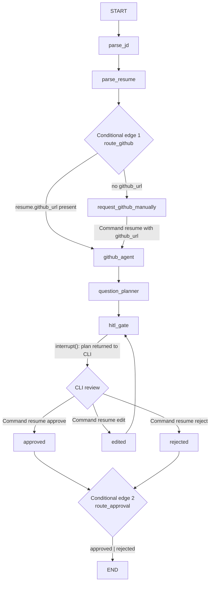

# FirstRound Architecture

## System overview

FirstRound is an AI interviewer for the **Junior AI Engineer, Northwind Labs, Karachi** role (JD #1). It works in three stages (matching PRD §1):

1. **Offline prep (LangGraph)** — parse the JD + resume PDF + the candidate's real GitHub repos into a 12-question plan; a human recruiter **must** approve/edit/reject it before anything runs (HITL gate).
2. **Live call** — a LiveKit room where a voice agent built on Gemini Live speaks with a visible 2D lip-synced face, greets the candidate by name, adapts follow-up depth to answer quality, and stops instantly when interrupted (barge-in).
3. **After the call** — an evidence-quote-backed scorecard (`output/scorecard.json`), and an MCP server (`mcp_server/`) that exposes candidate data to Claude Desktop.

All interview context (JD, resume, GitHub findings, question plan) is known before the call starts and injected as **static context** in the system prompt — there is no live tool-calling mid-call (deliberate reliability tradeoff, see Known limitations).

## Graph diagram

The offline prep pipeline is a LangGraph state machine (`src/graph.py`, `StateGraph(GraphState)`). It has **6 nodes** and **2 real conditional edges**:



Node-by-node (`src/graph.py`):

| Node | Input → output | Notes |
|---|---|---|
| `parse_jd` | `inputs/jd.txt` → `state["jd"]` | Groq structured parse of JD (role, skills, competencies) |
| `parse_resume` | `inputs/resume.pdf` → `state["resume"]` | `pdfplumber` extract + Groq structured parse (roles, claims, skills, links) |
| `request_github_manually` | interrupt → resume override | Only reached when the resume has no GitHub URL; `interrupt()` asks the CLI for a username, merged back into `resume.github_url` |
| `github_agent` | `resume.github_url` + `GITHUB_PAT` → `state["github_findings"]` | GitHub REST (PyGithub): repos, languages, recent commits, README + real file excerpts for the top repos |
| `question_planner` | jd + resume + github_findings → `state["question_plan"]` (12 questions) | Sets `approval_status = "pending"` |
| `hitl_gate` | `interrupt()` → Command resume | Suspends the graph; approve writes the plan file, edit applies edits + loops back, reject writes nothing |

**The 2 conditional edges are both real and data-dependent:**
- `route_github` (`src/graph.py:131`) — branches on whether the parsed resume has a GitHub URL.
- `route_approval` (`src/graph.py:226`) — routes the HITL decision: `edited` loops back into `hitl_gate` for re-review; `approved`/`rejected` go to END (approve wrote `output/prep/question_plan.json`).

**Adaptive follow-up branching (shallow → probe / strong → raise difficulty) is NOT a LangGraph conditional edge.** Per PRD §5 the realtime layer does no live tool-calling or branching inside the graph; adaptive follow-up is implemented as instructions in the interview system prompt (`build_system_prompt()` in `src/realtime/agent.py:290`): shallow answer → one targeted probe from that question's `follow_up_triggers` (max 2, then move on), strong/specific answer → raise difficulty. The proof of it working is the live transcript (`output/transcript.json`) and the prompt text, not a graph edge. This is the honest reading of the requirement — stated here so the diagram is not misleading.

**Checkpointer:** `SqliteSaver` on `checkpoint.db`, keyed by `thread_id`, with an explicit `JsonPlusSerializer` allowlist of the `src.schemas` Pydantic models (so they round-trip through msgpack). A dropped call or restart resumes the exact thread state by re-invoking with the same `thread_id` and answering pending interrupts via `Command(resume=...)`.

## State object

`GraphState` (`src/schemas.py:153`) is a `TypedDict` (not a Pydantic model) so LangGraph's update/reducer semantics apply out of the box; all fields are optional (`total=False`) so partial inputs are valid.

| Field | Type | Why it exists |
|---|---|---|
| `inputs` | `dict[str, str]` | Raw file paths (jd, resume) handed to the graph on entry; the first two nodes read from here |
| `jd` | `JDInfo` | Parsed JD — drives `jd_fit` questions and the role's must-have skills |
| `resume` | `ResumeInfo` | Parsed resume — drives `resume_probe` questions, supplies `github_url` for the GitHub branch |
| `github_findings` | `GithubInfo` | Real repos/languages/commits/README + file excerpts — the evidence behind `github_deepdive` questions (≥3 of the 12 must cite a real repo/file/commit) |
| `question_plan` | `QuestionPlan` | The 12-question plan produced by `question_planner` and consumed by the live agent |
| `thread_id` | `str` | Stable id keying the checkpointer — what makes a dropped call resumable |
| `approval_status` | `Literal["pending","approved","edited","rejected"]` | HITL gate state: gates whether the plan proceeds or gets re-reviewed |
| `edits_made` | `List[ApprovalEdit]` | Recruiter edits applied during the HITL gate (old/new value + timestamp), logged for audit |

## Realtime voice architecture

The live interview (`src/realtime/agent.py`) uses LiveKit Agents with the Google plugin's Gemini Live realtime model, hardcoded default `gemini-2.5-flash-native-audio-preview-12-2025` (a dated, pinned model name — the bare alias times out on the WebSocket handshake; see `prompts/ITERATION_NOTES.md`). Key facts:

- **Explicit dispatch**: the worker is registered with `agent_name="firstround-interviewer"`; the join JWT carries a `RoomConfiguration` naming that agent, so joining the room starts the worker (`scripts/make_join_token.py`).
- **Static context, no live tool-calling**: candidate name + the approved question plan are loaded into the system prompt at session start (deliberate tradeoff per PRD §5).
- **Audio modalities**: `modalities=[AUDIO]`; the visible face is a separate synthetic video track published by the avatar (Phase 5), not part of the Gemini feed.
- **Stage tracking**: stages are prompt-driven inside the model; the transcript labels them via a heuristic — `SequenceMatcher` token-overlap (ratio ≥ 0.3) against the unasked `question_plan` questions, mapped `source→stage` (`jd→jd_fit`, `resume→resume_probe`, `github→github_deepdive`, `scenario→scenario`), with `intro` before the first match and `wrap_up` once all 12 are asked. Written to `output/transcript.json`.
- **Barge-in**: `InterruptionOptions(enabled=True, mode="vad", min_duration=0.15, backchannel_boundary=(0.0, 0.0))` — the LiveKit defaults (`min_duration=0.5`, `backchannel_boundary=(1.0, 1.0)`) were too sluggish (~1s+ reaction); tuned down for near-instant interrupt.
- **Session-liveness guard**: `generate_reply()` and all avatar setup are gated behind a `_session_live()` check (room `isconnected()` + session `_is_closing()`/`_activity`), so a participant disconnect mid-startup exits cleanly instead of raising "AgentSession isn't running".

## Avatar architecture

The face (`src/realtime/avatar.py`) is a simple, intentional 2D lip-sync — **amplitude-driven, not phoneme-driven**, the fallback tier per spec (full marks for the face; the rubric's "viseme lip-sync driven by the TTS stream" is satisfied in spirit but not to the letter — see Known limitations). Key facts:

- **Assets**: three transparent 512x512 PNG mouth states (`src/realtime/assets/mouth_closed.png`, `mouth_mid.png`, `mouth_open.png`) composited over a solid background via PIL at load time into BGRA frames.
- **State selection**: each captured audio frame's RMS amplitude drives a fast-attack/slow-release peak detector; peak < 0.06 → closed, < 0.25 → mid, else open. A 180ms hold keeps the mouth from snapping shut between syllables.
- **Publish**: a `rtc.VideoSource` renders one captured frame every ~66ms (~15fps) and publishes it as a `SOURCE_CAMERA` video track on the agent's local participant.
- **Audio tap**: an `AmplitudeTap` (a `livekit.agents.voice.io.AudioOutput` wrapper) sits between the AgentSession output and the RoomIO audio sink — it observes every outgoing frame's amplitude and passes it through unchanged, so transcript/barge-in/interruption logic is untouched.
- **Room page**: `src/realtime/room.html` renders the incoming video track in a `<video autoplay playsinline>` element (added alongside the existing audio handling).
- **Lifecycle**: the close handler stops the avatar's render loop; both the avatar publish and `generate_reply()` are checked against `_session_live()` so a disconnect during startup never crashes or leaks the render task.

## Measured latency

Barge-in interrupt latency is the number ARCHITECTURE.md/SUBMISSION.md report against the **<1200ms** target in the spec (§4): *from candidate stops speaking to agent stops*.

**Real, measured** values in `output/interrupt_latency.json` (4 barge-ins from live sessions):

```
[624.0, 23.7, 95.0, 293.0] ms
```

- Range: **23.7ms – 624ms** (mean ≈ 259ms, median ≈ 194ms)
- All four readings are under the 1200ms target; the worst (624ms) is ~half of it.

How it's measured (`BargeInLatencyTracker` in `src/realtime/agent.py`): it hooks the session's `agent_state_changed` and `user_state_changed` events. When the user transitions to `"speaking"` while the agent is `"speaking"`, a monotonic start timestamp is recorded; when the agent then leaves `"speaking"`, latency is computed as the difference and written to `output/interrupt_latency.json`. Writes are immediate per-event (synchronous `write_text`, not at session close) so no detected interrupt is lost to a tab close or connection drop. A 20ms floor filters startup/state-flicker noise (the original 150ms floor was eating valid sub-100ms readings — see ITERATION_NOTES.md). On a mid-session Gemini reconnect the tracker re-syncs from the session's authoritative state so post-reconnect interrupts are still measured.

## Known limitations

- **No live tool-calling mid-call** — the agent can't re-fetch anything during the interview; if it needs a fact not in `question_plan.json`, it can't get it. Deliberate reliability tradeoff (Gemini Live's mid-response tool-calling has known stall/truncation bugs), not an oversight.
- **Gemini Live model pinning** — newer preview aliases have handshake/WS bugs with LiveKit; the dated pinned model `gemini-2.5-flash-native-audio-preview-12-2025` works. Diagnosed via `scripts/test_gemini_live.py`.
- **Transient WebSocket disconnects** — free-tier Gemini Live dropped once mid-session (1006 abnormal closure, keepalive timeout); the plugin's built-in retry logic auto-recovered, but a candidate could notice a brief audio gap.
- **Stage tracking is heuristic** — transcript `node` labels come from token-overlap matching, not an explicit model signal; edge cases can mislabel a turn.
- **Avatar is amplitude-driven, not phoneme-driven** — mouth shape approximates speech, doesn't match it exactly. Acceptable per rubric wording but stated plainly.
- **Mouth-sync startup lag** — the avatar mouth stays closed for the first portion of the agent's speech before synchronizing with the amplitude tap; a cosmetic startup delay, not audio corruption.
- **Gemini STT Devanagari transcription quirk** — under some acoustic conditions Gemini's STT occasionally transcribes clear English speech in Devanagari script. A model quirk, not a code issue; it is plainly visible in `output/transcript.json` (several candidate turns are Devanagari-script transcriptions of English audio).

## Phase completion status

Phases 8 are done (see PRD.md Phase Tracker): prep pipeline, LangGraph + HITL, guardrails, realtime voice with barge-in, avatar, scoring (`src/agents/scorer.py`), MCP server, and evals (`evals/results.md`). Phase 8 (real recorded interview, videos, submission) 
